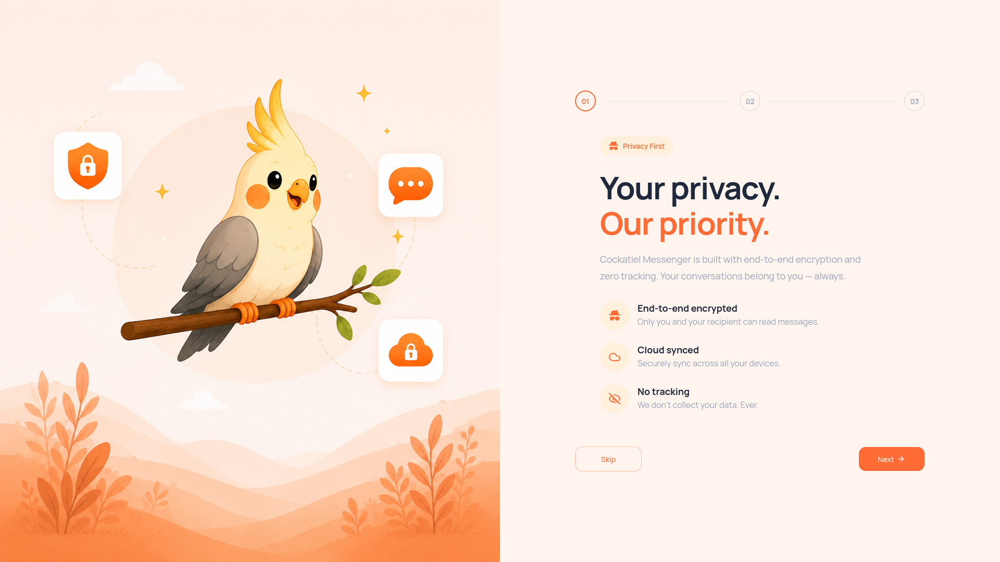

# Joo-joo Messenger

<p align="center">
  
</p>

<p align="center">
  <strong>Privacy-first open source messenger built with Next.js, Bun, and Elysia.</strong>
</p>

<p align="center">
  No ads • No tracking • Community driven
</p>

<p align="center">
  
  
  
</p>

---

## Why Jojo Messenger?

Most messaging platforms ask people to trade privacy for convenience.

Jojo Messenger is being built to show that modern communication can be:

- Private
- Open source
- Community driven
- Transparent
- Self-hostable

The goal is simple: build a messenger that belongs to its users, not advertisers.

---

## Current Status

⚠️ **Active development**

Jojo Messenger is under heavy development and is not production ready yet.

Expect rapid changes, evolving APIs, and ongoing design improvements.

This is the best time to get involved and help shape the project.

---

## Features

### Implemented

- [x] Open source monorepo
- [x] Authentication flow
- [x] Responsive onboarding experience
- [x] Modern UI built with Tailwind CSS and shadcn/ui

### In Progress

- [ ] Real-time messaging
- [ ] Conversations and direct messages
- [ ] Presence and online status
- [ ] File uploads
- [ ] User profiles

### Planned

- [ ] End-to-end encryption
- [ ] Self-hosting support
- [ ] Group chats
- [ ] Push notifications
- [ ] Desktop client

---

## Roadmap

### Phase 1 — Foundation

- Authentication
- User management
- Profiles
- Infrastructure and deployment

### Phase 2 — Messaging

- Conversations
- Direct messages
- Realtime communication
- Presence

### Phase 3 — Privacy

- End-to-end encryption
- Key management
- Secure backups

### Phase 4 — Community

- Self-hosting
- Plugins
- Federation research
- Better contributor tooling

---

## Tech Stack

### Backend

- Bun
- Elysia
- PostgreSQL
- Drizzle ORM
- Redis
- WebSockets
- Nginx

### Frontend

- Next.js
- React
- TypeScript
- TanStack Query
- Zustand
- Tailwind CSS
- shadcn/ui

### Infrastructure

- Docker
- Docker Compose
- GitHub Actions

---

## Getting Started

### Requirements

- Bun
- Docker
- Docker Compose

### Clone the repository

```bash
git clone https://github.com/Cockatiel-labs/Joo-Joo-Messenger.git
cd Joo-Joo-Messenger
```

### Install dependencies

```bash
bun install
```

### Configure environment variables

```bash
cp .env.example .env
```

Update the values in `.env` to match your local setup.

### Start infrastructure services

```bash
docker compose -f ./infra/docker/docker-compose.yml up -d
```

### Run the backend

```bash
bun run dev:api
```

### Run the frontend

```bash
bun run dev:web
```

---

## Contributing

Contributions, ideas, bug reports, design feedback, and documentation improvements are all welcome.

If you are new to the project, a great place to start is:

- `good first issue`
- `help wanted`
- documentation tasks
- UI polish
- bug fixes

### Before you open a pull request

Please:

1. Read [`CONTRIBUTING.md`](./CONTRIBUTING.md)
2. Search existing issues first
3. Keep changes focused
4. Run formatting and linting
5. Update documentation when needed

---

## Community Help Wanted

The project would especially benefit from help in these areas:

### Frontend

- Responsive layouts
- Accessibility improvements
- Design system consistency
- Onboarding flow polish

### Backend

- Messaging architecture
- WebSocket handling
- Performance improvements
- API structure

### Security

- Authentication review
- Encryption design
- Security audits

### Documentation

- Setup guides
- Architecture notes
- API usage examples
- Contributor onboarding

---

## Documentation

Additional documentation can be found in the `docs/` directory as the project grows.

---

## License

This project is licensed under the GNU General Public License v3.0 (GPL-3.0).

See the LICENSE file for details.
